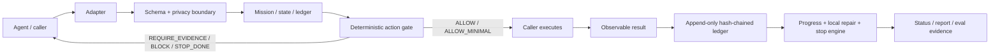

# OutcomeRail

**Minimum cost to accepted outcome for AI coding agents.**

> Ponytail minimizes unnecessary implementation.  
> OutcomeRail minimizes unnecessary execution.

OutcomeRail is a model-agnostic runtime execution guard. It evaluates proposed agent actions against an explicit mission contract, preserves observable evidence, detects repeated work, narrows broad actions, and stops execution once required acceptance criteria pass.

It is an installable Python CLI—not a prompt-only demonstration.

## What it prevents

- repeated searches, file reads, and test runs without new evidence;
- unjustified full-repository scans and full test suites;
- action sequences with no acceptance delta;
- scope creep and work on optional criteria before required outcomes;
- restarting a task after a local failure instead of repairing the failed surface;
- execution after acceptance has already been achieved;
- protected actions without explicit human authorization.

## What it does not optimize away

Correctness, security, privacy, permissions, accessibility, data integrity, reliability, deterministic verification, and protected human gates take priority over execution cost.

## Five-minute quick start

Requires Python 3.11 or later.

```bash
python -m venv .venv
. .venv/bin/activate          # Windows: .venv\Scripts\activate
pip install -e .

DEMO_ROOT="$(mktemp -d)"
outcomerail validate examples/small-feature/mission.json
outcomerail init examples/small-feature/mission.json --root "$DEMO_ROOT"
outcomerail before-action examples/small-feature/action.json --root "$DEMO_ROOT"
```

The bundled small-feature action is allowed because it advances a declared criterion within scope. A broad full-suite proposal is instead narrowed to the criterion's targeted verification and returns `ALLOW_MINIMAL / TARGETED_TEST_BEFORE_FULL_SUITE`.

After an allowed action completes, record only observable result metadata:

```bash
outcomerail after-action examples/small-feature/result.json --root "$DEMO_ROOT"
outcomerail status --root "$DEMO_ROOT"
outcomerail report --format markdown --root "$DEMO_ROOT"
```

Run the deterministic policy eval corpus:

```bash
outcomerail eval --summary
```

## CLI

```text
outcomerail init [mission.json]
outcomerail validate <mission.json>
outcomerail before-action <event.json>
outcomerail after-action <result.json>
outcomerail status
outcomerail report [--format json|markdown]
outcomerail eval [--cases evals/cases]
```

### Exit codes

| Code | Meaning |
|---:|---|
| `0` | `ALLOW`, `ALLOW_MINIMAL`, or successful non-gate command |
| `2` | malformed/invalid input; fail closed |
| `20` | `REQUIRE_EVIDENCE` |
| `21` | `BLOCK` |
| `22` | `STOP_DONE` |
| `23` | protected action requires human authorization |
| `70` | local I/O or internal failure |

## Architecture



OutcomeRail never requests or stores private chain-of-thought. Inputs containing common private-reasoning fields are rejected recursively.

## Risk modes

| Mode | Intended use | Before execution | After execution |
|---|---|---|---|
| `FAST` | low-risk, reversible | execute directly | one direct acceptance check |
| `STANDARD` | medium-risk | one material pre-check for mutations | targeted verification first |
| `STRICT` | high-risk or hard to reverse | validate assumptions and declare post-check; independent review for high risk | deterministic evidence |
| `PROTECTED` | human-gated actions | stop | no execution without external authorization |

## Adapters

- **Generic JSONL:** direct observable event mapping.
- **Codex:** `AGENTS.md` guidance plus an explicit wrapper. It does not claim universal native interception across every Codex surface.
- **Claude Code:** hook-compatible wrapper where the selected lifecycle hook provides sufficient observable fields; degradation is explicit.
- **Hermes:** shadow/canary only. It does not change live routing, leases, worktrees, permissions, or founder gates.

See [`adapters/README.md`](adapters/README.md) and the
[`adapter support matrix`](docs/adapter-support-matrix.md).

## Evaluation truthfulness

The bundled 30 cases are deterministic policy trace replays. They test decisions and state transitions. They are **not** live-model performance results and do not establish token, time, or cost savings.

Live comparisons must use separately captured traces for:

1. baseline;
2. Ponytail only;
3. OutcomeRail only;
4. Ponytail + OutcomeRail.

Unknown tokens, time, and cost remain `UNKNOWN`; OutcomeRail does not invent them.

## Non-goals

OutcomeRail is not:

- an LLM, agent framework, or autonomous orchestrator;
- a chain-of-thought collector;
- a replacement for sandboxing, code review, CI, or access control;
- a guarantee of correctness or security;
- a Ponytail fork, wrapper, dependency, or rebrand;
- a production authorization system for protected actions.

## Security and privacy defaults

- no external telemetry;
- local files only;
- append-only JSONL ledger with SHA-256 hash chaining;
- restrictive ledger file mode where supported;
- malformed documents fail closed;
- protected actions block before execution;
- observable metadata only.

Read [`SECURITY.md`](SECURITY.md) and [`docs/threat-model.md`](docs/threat-model.md) before integrating enforcement into a privileged workflow.

## Development

```bash
python -m venv .venv
. .venv/bin/activate
pip install -e '.[dev]'
pytest
ruff check .
mypy src/outcomerail
bandit -c pyproject.toml -r src
python -m build
```

## Project status

`0.1.0` is an MVP release candidate prepared locally. External publication is intentionally gated on maintainer approval. No public adoption, download, contributor, or live-model benchmark claims are made. See [`PUBLICATION_CHECKLIST.md`](PUBLICATION_CHECKLIST.md).

## License

Apache License 2.0. See [`LICENSE`](LICENSE) and [`NOTICE`](NOTICE).
